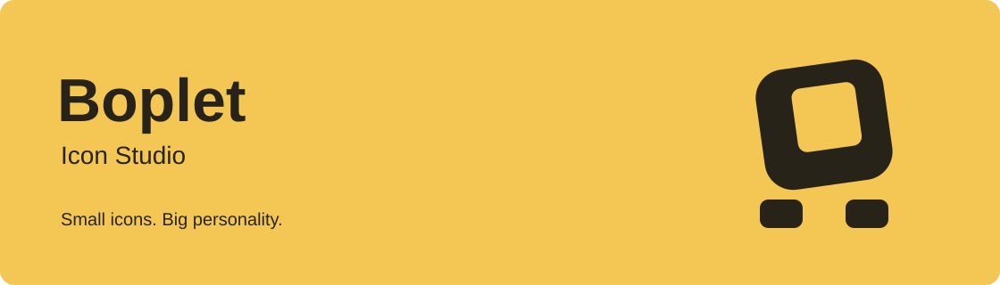
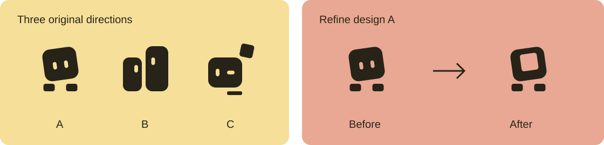

<p align="center"><strong>English</strong> · <a href="README.zh-CN.md"><strong>简体中文 →</strong></a></p>



<p align="center"><a href="https://boplet.app/">Website</a> · <a href="https://boplet.app/#get-started">Get started</a> · <a href="https://boplet.app/studio/">Open workspace</a></p>

# Your new favorite icon design tool

Share your ideas with your AI assistant. View icons, choose a design, and export SVGs in **Boplet**.

Boplet pairs a design Skill with a lightweight web workspace. The Skill guides the assistant through the brief, design directions, geometry, and size checks. The workspace lets you inspect the results and decide what comes next.

## Get started

| | Online with WebMCP | Local with Skill |
| --- | --- | --- |
| Browser and assistant support | WebMCP required | WebMCP not required |
| Installation | No local Skill installation | Install the complete Skill package |
| Project storage | Your authorized local folder | Your authorized local folder |

**Online:** open [boplet.app](https://boplet.app/#get-started), copy the online instructions, and send them to your assistant. It loads the Skill from the website. After your consent, the page opens the workspace and asks you to authorize a folder.

**Local:** copy the local instructions from the same page. Your assistant downloads and verifies the complete Skill package, installs it with your permission, and opens the bundled local workspace. Node.js 22.23.1 or later in the 22.x series is required on the host.

Skill distribution is through [GitHub Releases](https://github.com/walnut-a/boplet-icon-studio/releases), not npm. The website points to the complete Release package and its SHA-256 checksum. You can also build from a pinned checkout; the raw `skill/` folder alone is not installable. The current release is a development preview.

Already have a project? Open [the workspace](https://boplet.app/studio/) to view and export it. No Agent or WebMCP is needed for viewing; your browser must support local folder access and you may need to authorize the folder again.

> Boplet does not upload your project files to its server. Your AI assistant’s own data handling is governed by its provider and configuration.

## From an idea to an icon



- **Explore:** compare different directions from the same brief.
- **Refine:** ask your assistant to adjust the geometry, character, and small-size details.
- **Deliver:** confirm a main design, inspect sizes and contexts, and export SVGs. Alternatives are kept by default.

Boplet’s own icon started with “make it more fun.” We compared three drafts, chose A, and replaced its eyes with an offset opening while keeping the tilted head and small feet.

## Preview status

The website and downloadable Skill are **development previews**. Online and local workflows share the same core and data contracts. Browser/Agent WebMCP support varies; the local route remains available when WebMCP is missing.

Windows hardware validation and the full folder-permission / cross-runtime handoff matrix are still pending. Automatic updates and legacy-data migration are not provided. Keep backups of important work.

## Develop

Use Node.js **22.23.1–22.x** and npm. Browser tests require a locally installed Google Chrome.

```sh
npm ci --ignore-scripts
npm test
npm run build
npm run build:web
npm run test:e2e
```

Serve `dist/web` with a local static server to preview the website and `/studio/`. For example, if Python 3 is available:

```sh
python3 -m http.server 53058 --bind 127.0.0.1 --directory dist/web
```

For a complete installable Skill, run `npm run pack:skill`. Installing only the raw `skill/` directory from this checkout omits required built runtime assets. See [Contributing](CONTRIBUTING.md) for packaging, local runtime setup, and checks.

Maintainers: see the [development, local testing, and release pipeline](docs/开发测试与发布.md) (Chinese). One verified candidate is reused for local installation, GitHub assets, and website distribution; preparing it never publishes or installs it automatically.

## Repository guide

| Path | Purpose |
| --- | --- |
| `skill/` | Design methodology, agent instructions, and references |
| `src/web/` | Public website and browser runtime |
| `src/app/` | Shared project, icon, and inspection UI |
| `src/core/` | Shared business logic and geometry |
| `src/contracts/` | Validated documents and operation contracts |
| `src/storage/`, `src/runtime/`, `src/transports/` | Local data, servers, and WebMCP adapters |
| `tests/` | Unit, contract, integration, and browser tests |

Detailed [requirements](docs/产品图标工坊-项目化架构与双端产品方案.md) and the [development ledger](docs/产品图标工坊-开发计划.md) are currently maintained in Chinese. Dated entries describe historical milestones, not the current installation or deployment state.

## License and inspiration

[MIT](LICENSE). Third-party dependencies retain their own licenses; see [Third-party notices](THIRD_PARTY_NOTICES.md).

Inspired by Minor Adventures’ [The Making of Cursor’s Icons](https://www.minoradventures.co/blog/the-making-of-cursors-icons). Boplet’s implementation and brand artwork are its own; the linked article is not included or relicensed here.
